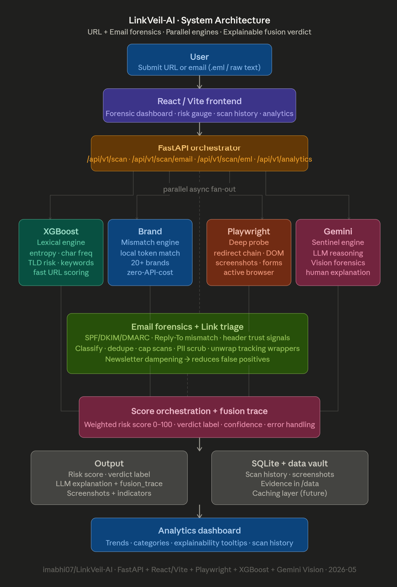

# 🛡️ LinkVeil-AI 

**The ultimate real-time phishing detection system powered by Hybrid AI.**

[](https://www.python.org/downloads/)
[](https://react.dev/)
[](https://www.typescriptlang.org/)
[](https://tailwindcss.com/)
[](https://fastapi.tiangolo.com/)

[](https://ai.google.dev/)
[](https://playwright.dev/)
[](https://pytorch.org/)
[](https://opensource.org/licenses/MIT)

LinkVeil-AI is an advanced, multi-layered security platform that provides real-time protection against sophisticated phishing attacks. By orchestrating Deep Learning, Gradient Boosting, LLMs, and Active Browser Probing, LinkVeil delivers high-accuracy verdicts with human-readable explanations.

---

## 🔥 Key Highlights

*   **⚡ Hybrid Intelligence**: Combines DistilBERT (Semantic), XGBoost (Lexical), and Gemini Pro (Cognitive).
*   **🕵️ Active Probing**: Real-time browser agent (Playwright) analyzes live page behavior and redirects.
*   **👁️ Visual Forensics**: pHash similarity & Brand spoofing detection (Amazon, Apple, etc.).
*   **📡 Threat Intelligence**: Real-time short-circuiting via OpenPhish & URLhaus feeds.
*   **🧠 Cyber Analyst**: Receives detailed explanations of *why* a site was flagged, powered by Gemini.
*   **📊 Analytics Dashboard**: Premium dashboard for tracking threat trends and scan volume.
*   **🎨 Premium UI**: Glassmorphic, animated React dashboard for a seamless security experience.

---

## 🏗️ Architecture at a Glance



*A multi-layered defense strategy combining behavioral, lexical, and semantic intelligence.*

---

## 📂 Project Structure

```bash
.
├── backend/                # FastAPI High-Performance Backend
│   ├── app/
│   │   ├── models/         # Pydantic Schemas & DB Models
│   │   ├── routes/         # API Scanning Endpoints
│   │   ├── services/       # AI Engines: Gemini, Playwright, XGBoost
│   │   └── main.py         # Entry Point
│   └── requirements.txt    # Python Dependencies
├── frontend/               # React + Vite Forensic Dashboard
│   ├── src/
│   │   ├── components/     # UI/UX Glassmorphic Components
│   │   ├── types.ts        # Global Forensic Types
│   │   └── App.tsx         # Dashboard Orchestrator
│   └── tailwind.config.js  # Premium Design Tokens
├── ml/                     # Machine Learning Lab
│   ├── datasets/           # Pre-processing & Feature Extraction
│   ├── models/             # Local Weights for XGBoost & DistilBERT
│   └── train.py            # Model Training Orchestation
├── data/                   # Persistent Storage (SQLite)
├── docs/                   # Technical Assets & Diagrams
└── docker-compose.yml      # Containerized Deployment
```

---

## 🚀 Quick Start Instructions

### 1. Prerequisites
- **Python 3.11+** & **Node.js 18+**
- **Git LFS** (Required for pre-trained weights)

### 2. Initialization
```bash
git clone https://github.com/imabhi07/LinkVeil-AI.git
cd LinkVeil-AI
git lfs install
git lfs pull
```

### 3. Backend Setup (The Brain)
1. **Configure Environment**: Create a `.env` file in the root directory.
   ```env
   GOOGLE_API_KEY=your_gemini_api_key
   DATABASE_URL=sqlite:///./data/linkveil.db
   ```
2. **Install & Run**:
   ```bash
   python -m venv venv
   .\venv\Scripts\activate  # Windows
   pip install -r backend/requirements.txt
   playwright install chromium
   uvicorn backend.app.main:app --host 0.0.0.0 --port 8000 --reload
   ```

### 4. Frontend Setup (The Face)
```bash
cd frontend
npm install
npm run dev
```

---

## 🧪 Manual Model Training (Developer Mode)

If you prefer not to use Git LFS or wish to train your own version:

1.  **Prepare Data**: `python ml/datasets/prepare_data.py`
2.  **Train Models**: 
    - `python ml/train_xgboost.py` (Fast)
    - `python ml/train.py` (Expensive - GPU Recommended)

---

## 📖 Deep Dive Documentation

Looking for more details? Check out our specialized guides:
- 📘 **[Technical Architecture & ML Deep Dive](PROJECT_DETAILS.md)**
- 📝 **[Environment Variable Reference](backend/.env.example)**

---

## 🤝 Contributing
Contributions are welcome! Please open an issue or submit a pull request for any improvements.

## 📜 License
This project is licensed under the MIT License - see the [LICENSE](LICENSE) file for details.
