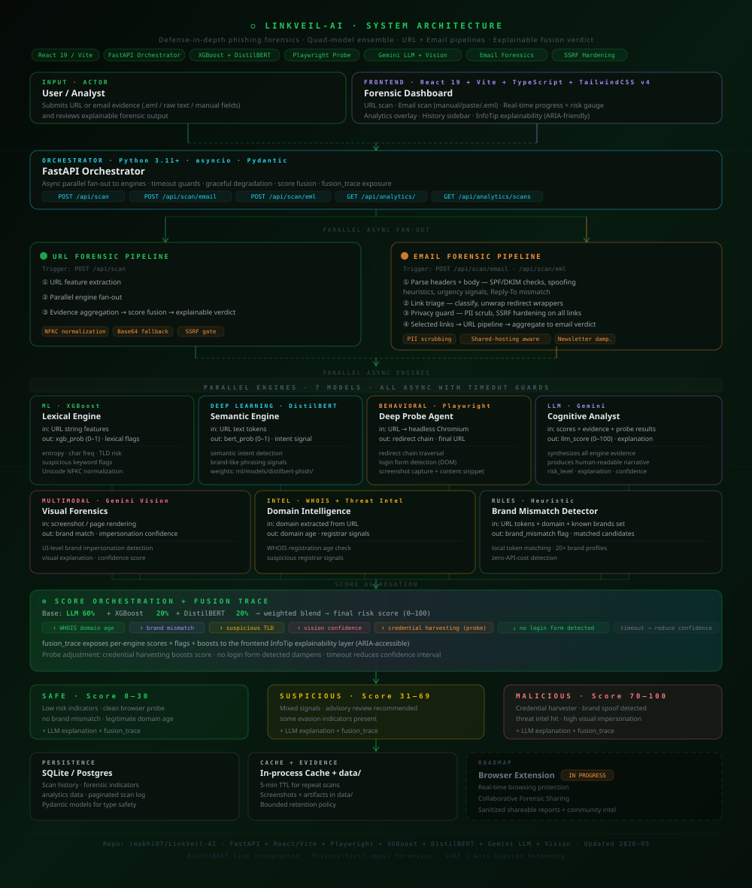

# 🛡️ LinkVeil-AI 

**The ultimate real-time phishing detection system powered by Hybrid AI.**

[](https://www.python.org/downloads/)
[](https://react.dev/)
[](https://www.typescriptlang.org/)
[](https://tailwindcss.com/)
[](https://fastapi.tiangolo.com/)

[](https://ai.google.dev/)
[](https://playwright.dev/)
[](https://xgboost.readthedocs.io/)
[](https://opensource.org/licenses/MIT)

LinkVeil-AI is an advanced, multi-layered security platform providing real-time protection against sophisticated phishing attacks. By orchestrating XGBoost (lexical analysis), DistilBERT (semantic analysis), Gemini LLM (cognitive reasoning), Gemini Vision (visual forensics), and active browser probing, LinkVeil delivers high-accuracy verdicts with human-readable explanations.

---

## 🔥 Key Highlights

*   **⚡ Hybrid Intelligence**: Quad-model ensemble combining XGBoost (Lexical), DistilBERT (Semantic), Gemini LLM (Cognitive), and Gemini Vision (Visual).
*   **📧 Email Forensic Scanner**: Deep analysis of `.eml` files and raw email text with header authentication (SPF/DKIM) and heuristic scoring.
*   **🕵️ Active Probing**: Real-time browser agent (Playwright) analyzes live page behavior and redirects.
*   **👁️ Visual Forensics**: Integrated Gemini Vision for visual brand recognition and impersonation detection.
*   **🔒 Forensic Session Security**: Mandatory `X-Client-ID` header enforcement for multi-tenant data isolation and forensic session integrity.
*   **🛡️ Anti-Evasion Hardening**: NFKC Unicode normalization, Base64 fallback parsing, and shared hosting (Vercel, Firebase) awareness.
*   **🛡️ Brand Mismatch Engine**: Local, zero-API-cost token matching for 20+ global brands.
*   **📡 Intelligence Dashboard**: Real-time aggregation of forensic indicators, categories, and historical trends.
*   **🎨 Premium UI**: A high-contrast "Cyber-Botanical" dashboard with enhanced light mode accessibility and professional glassmorphism.

---

## 🏗️ Architecture at a Glance



*A multi-layered defense strategy (v1.1.0) combining behavioral, lexical, and semantic intelligence.*

---

## 📂 Project Structure

```bash
.
├── backend/                        # FastAPI High-Performance Backend
│   ├── app/
│   │   ├── features/               # Feature extraction: URL, Email, Link Triage
│   │   ├── models/                 # Pydantic Schemas & DB Models (String(64) IDs)
│   │   ├── routes/                 # API Endpoints (v1 versioned)
│   │   ├── services/               # Core Forensic Engines
│   │   ├── utils/                  # Auth & Security Utilities
│   │   ├── migrate_db.py           # Hardened Database Migration Script
│   │   └── main.py                 # Entry Point (FastAPI v0.115+)
├── frontend/                       # React + Vite Forensic Dashboard
│   ├── src/
│   │   ├── components/             # Forensic UI Components
│   │   ├── types.ts                # Global Forensic Types
│   │   └── App.tsx                 # Dashboard Orchestrator (Session Guarded)
├── ml/                             # Machine Learning Lab (XGBoost, DistilBERT)
├── extension/                      # Browser Extension (In Progress)
├── data/                           # Persistent Storage (SQLite + screenshots)
├── tests/                          # Pytest test modules
└── docs/                           # Technical Assets & Diagrams
```

---

## 🚀 Quick Start Instructions

### 1. Prerequisites
- **Python 3.12+** & **Node.js 20+**

### 2. Clone the Repository
```bash
git clone https://github.com/imabhi07/LinkVeil-AI.git
cd LinkVeil-AI
```

### 3. Backend Setup (The Brain)
1. **Configure Environment**: Create a `.env` file in the root directory.
   ```env
   GEMINI_API_KEY=your_gemini_api_key
   DATABASE_URL=sqlite:///./linkveil.db
   SECRET_KEY=your_random_secret_key
   ALLOWED_ORIGINS=http://localhost:5173
   ```
   > [!IMPORTANT]
   > In production, `ALLOWED_ORIGINS` (line 86) must be updated to your actual frontend domain(s). It supports a single origin or a comma-separated list (e.g., `https://dashboard.example.com,https://api.example.com`). **Never use a wildcard (`*`) in production** as it disables CORS security protections for the forensic data store.
2. **Setup Virtual Environment**:
   ```bash
   python -m venv venv
   .\venv\Scripts\activate  # Windows
   ```
3. **Install Dependencies & Browser**:
   ```bash
   pip install -r backend/requirements.txt
   playwright install chromium
   ```
4. **Initialize Database**:
   ```bash
   python -m backend.app.migrate_db
   ```
5. **Launch Backend**:
   ```bash
   uvicorn backend.app.main:app --host 0.0.0.0 --port 8000 --reload
   ```

### 4. Frontend Setup
1. **Install & Launch Dashboard**:
   ```bash
   cd frontend
   npm install
   npm run dev
   ```

---

## 🛰️ API Endpoints (v1)

All forensic endpoints require a mandatory `X-Client-ID` header for session isolation.

| Endpoint | Method | Description |
|---|---|---|
| `/api/v1/scan` | POST | Submit a URL for full forensic analysis |
| `/api/v1/scan/email` | POST | Analyze raw email text for threats |
| `/api/v1/scan/eml` | POST | Upload and analyze `.eml` forensic files |
| `/api/v1/analytics/` | GET | Historical trends and stats (Auth Required) |
| `/api/v1/analytics/scans` | GET | Paginated forensic records (Auth Required) |

---

## 🧪 Testing & Validation

```bash
# Run all tests
pytest tests/ -v

# Run specific service tests
pytest tests/test_email_scan.py
```

---

## 🧪 Manual Model Training (Developer Mode)

Train the ML engines (XGBoost & DistilBERT) from scratch:

1.  **Prepare Data**: `python ml/datasets/prepare_data.py`
2.  **Train XGBoost** (Required):
    ```bash
    python ml/train_xgboost.py
    ```
3.  **Train DistilBERT** (Required):
    > [!NOTE]
    > DistilBERT is fully integrated into the live pipeline alongside XGBoost and Gemini to provide deep semantic evaluation of malicious intent. A GPU is recommended for optimal inference speed.
    ```bash
    python ml/train.py
    ```

---

## 📖 Deep Dive Documentation

- 📘 **[Technical Architecture & Deep Dive](PROJECT_DETAILS.md)**
- 📝 **[Environment Variable Reference](backend/.env.example)**

---

## 🗺️ Roadmap

- [x] **Forensic Session Isolation**: Multi-tenant data protection via Client ID.
- [x] **Email Forensic Pipeline**: Full support for `.eml` and raw text analysis.
- [x] **Intelligence Analytics**: Multi-dimensional trend tracking and dashboard.
- [ ] **Browser Extension**: Real-time protection while browsing (In Progress).

---

## 🤝 Contributing
Contributions are welcome! Please open an issue or submit a pull request.

## 📜 License
This project is licensed under the MIT License - see the [LICENSE](LICENSE) file for details.
